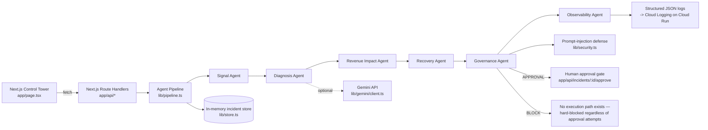

# Revenue Sentinel — Architecture

## Overview

Deployment target: **Cloud Run** (container built from the included `Dockerfile`).
AI reasoning: **Gemini API** (direct REST call, no SDK dependency), used by the
Diagnosis Agent when `AGENT_MODE=gemini` and `GEMINI_API_KEY` is set — MOCK
mode is the default and is fully deterministic so the demo never depends on
network access to Google's API.

## Agent responsibilities

| Agent | Input | Output | Notes |
|---|---|---|---|
| Signal | synthetic `PaymentEvent[]` | authorization rate, delta vs baseline, dominant error code, webhook latency, anomaly flag + severity | pure rule-based, no LLM call |
| Diagnosis | Signal output + events | likely root cause + contributing factors | rule-based hypothesis always computed first; Gemini (if enabled) is asked to phrase/augment it, and any failure falls back to the rule-based text unchanged |
| Revenue Impact | events + Signal output | observed declined amount, estimated recoverable amount, monthly run-rate estimate | always labeled as an estimate/reference value; excludes suspected-fraud declines from the recoverable pool |
| Recovery | Signal + Diagnosis output | one proposed `RecoveryPlan` with an action type and required approvals | never itself executes anything |
| Governance | events + Recovery plan | `AUTO` / `APPROVAL` / `BLOCK` + rationale + security findings | the only agent with authority to change the incident's execution status; see below |
| Observability | all prior steps | structured decision trail + audit log entries | writes one structured JSON log line per step; Cloud Logging ingests stdout JSON automatically on Cloud Run |

## Governance model

Governance classification is a **hard policy table**, not a model judgment:

1. `refund` and `fund_transfer` action types are **always** `BLOCK` — there is
   no code path anywhere in this project that calls a real payment
   execution API, so proposing one of these action types can never lead to
   real fund movement regardless of classification.
2. Every other action type has a base classification (`notify_ops` /
   `open_psp_incident` / `escalate_to_psp_risk_team` → `AUTO`;
   `retry_soft_decline` / `traffic_shift` → `APPROVAL`).
3. If a **prompt-injection or control-bypass attempt** is detected anywhere
   in the incident's underlying data (see below), the classification is
   force-escalated to `BLOCK` regardless of what the base classification
   would have been. Security findings can only ever escalate a decision,
   never soften one.
4. The human-approval API endpoint (`POST /api/incidents/:id/approve`)
   enforces rule 3 server-side: it refuses (`409`) to approve any incident
   currently classified `BLOCK`. This is intentional defense in depth — a
   compromised or careless UI/client cannot talk the backend into executing
   a blocked action.

## Prompt-injection defense

Any free-text field that could plausibly originate from outside the system
(currently: `PaymentEvent.customerNote`, modeling a customer-supplied
descriptor or webhook note) is treated as **untrusted data**, never as an
instruction:

- `lib/security.ts#detectInjection` scans it for known instruction-override,
  role-override, fake-system-turn, fund-movement-request, and
  control-bypass patterns and returns typed findings.
- `lib/security.ts#sanitizeForPrompt` wraps any such text in explicit
  `UNTRUSTED_CUSTOMER_TEXT` delimiters, strips control characters and
  code-fence/angle-bracket breakout characters, and truncates it before it
  is ever concatenated into a Gemini prompt (see `lib/agents/diagnosis.ts`).
- The Governance Agent (not the LLM) makes the final call — even if a
  future model were talked into producing an unsafe suggestion, Governance
  still enforces the hard policy table above.

The `prompt-injection-attempt` scenario (`lib/scenarios/index.ts`) exercises
this end to end: one event's `customerNote` contains an embedded instruction
asking the pipeline to auto-approve a refund and disable logging. The
pipeline detects it, never follows it, and forces the incident to `BLOCK`.
See `tests/security.test.ts`, `tests/governance.test.ts`, and the
`prompt-injection-attempt` case in `tests/pipeline.test.ts`.

## Data & persistence

- Scenarios are deterministic and defined in code (`lib/scenarios/index.ts`)
  — no external data source, so the demo is 100% reproducible.
- Incident traces and the audit log live in an in-memory `Map`
  (`lib/store.ts`) for the MVP. This is sufficient for a live demo on a
  single Cloud Run instance but resets on cold start and is not shared
  across instances or scaled replicas.
  - **Upgrade path**: swap `lib/store.ts` for Firestore (simplest — a
    single collection keyed by incident id, no schema migration needed
    since `IncidentTrace` is already a plain JSON-serializable object) or
    BigQuery (better for historical trend analysis / baseline learning
    across incidents, worse fit for low-latency single-incident reads).
- Ingestion is currently synchronous and triggered by the UI ("Run incident
  investigation" → `POST /api/investigate`). Pub/Sub-based ingestion from
  real PSP webhooks is the natural post-MVP step once the synchronous demo
  is stable, per the original build brief in `docs/CLAUDE_CODE_PROMPT.md`.

## Observability

Every agent step records `evidence[]`, `confidence` (0–1), `reasoningMode`
(`mock` or `gemini`), and `startedAt`/`finishedAt` timestamps. The
Observability Agent assembles these into the incident's `auditLog`, and
`lib/logger.ts` writes one structured JSON line per completed step to
stdout — Cloud Run forwards stdout JSON to Cloud Logging automatically,
with `severity` and `jsonPayload` fields recognized natively, so no logging
SDK integration is required for the demo.

## What this project deliberately does not do

- It never calls a real payment execution API (no `retryCharge`,
  `createRefund`, `initiateTransfer`, etc. exist anywhere in the codebase).
- It never stores or requests PAN/CVC or real cardholder data — all
  `PaymentEvent` data is synthetic and defined in code.
- It never lets an LLM output directly change a governance decision or
  bypass the approval gate.
